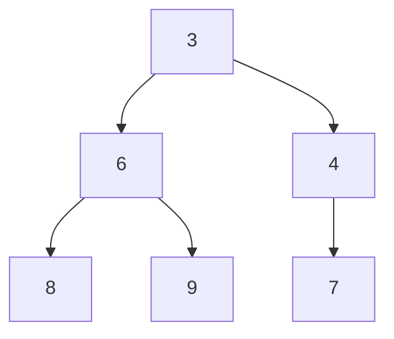

# 1. 정렬

title: 정렬
date: 2024년 12월 18일 오전 12:00 (GMT+9)
categories: Language, C++
tags: C++

# 선택 정렬

**시간복잡도 O($n^2$)**

배열 전체를 순회하며 자리를 교체.

시간 복잡도가 커 비효율적인 방식이다.

```cpp
int array[10]={1,10,...};
for(int i=0; i<10; i++){
	for(j=i; j<10; j++){
		if(array[i]<min) {
			min=array[i];
			index = j;}
		}
	temp=array[i];
	array[i]=min;
	array[index]=temp;
}
```

# 버블 정렬

**시간 복잡도 O($n^2$)**

배열 전체를 순회하며 앞자리와 뒷자리를 교체.

시간 복잡도가 커 비효율적인 방식**이다.**

```cpp
vector<int> bubble_sort(vector<int> target){
	int n=target.size(); 
	int temp;
	for(int i=0; i<n-1; i++){
		for(int j=0; j<n-i-1; j++){
			if(target[j]>target[j+1]){
				temp=target[j+1];
				target[j+1] = target[j];
				target[j]=temp;
			}
		}
	}
}
```

# 삽입 정렬

**시간 복잡도 O($n^2$)**

특정 숫자 key를 정하고, 그 key의 앞을 조사하여 key보다 큰 숫자가 있으면 자리를 찾아서 넣음.

시간 복잡도가 커 비효율적인 방식이지만 배열이 거의 정렬되어 있다면 매력적이다.

```cpp
vector<int> insertion_sort(int list[], int n){
	int i,j,key;
	for(i=1; i<n; i++){
		key=list[i];
		for(j=i-1; j>=0&&list[j]>key;j--){
			list[j+1]=list[j];
		}
		list[j+1]=key;
	}
}
```

# 병합 정렬


**시간복잡도는 O(nlogn)**

정렬되지 않은 배열 arr을 분할하고, arr의 i번째 수와 j번째 수를 비교해서 더 작은 수를 arr2의 k번째에 넣는 방식으로 정렬하는 코드.

```cpp
int N, arr[1000001];
int *arr2;

void merge(int left, int right){ //병합
	int mid=(left+right)/2;
	int i=left;
	int j=mid+1;
	ink k=right;
	
	while(i<=mid&&j<=right){
		if(arr[i]<=arr[j])
			arr2[k++]=arr[i++] //arr2[k]에 arr[i]를 저장한 후 증가한다.
		else
			arr2[k++]=arr[j++]; 
			
	int temp=i>mid?j:i;
	while(k<=right) 
		arr2[k++]=arr[temp++];
		
	for(int i=left; i<=right; i++)
		arr[i]=arr2[i];
}

void partition(int left, int right){ //분할
	int mid;
	if(left <right){
		mid=(left+right)/2; 
		partition(left,mid); partition(mid+1, right);
		merge(left, right);
	}
}

int main(){
	arr2=new int[N];
	partition(0,N-2);
}
```

# 퀵정렬

**시간복잡도는 O(nlogn**)

한 부분배열에서 pivot을 설정하고 pivot보다 작으면 좌, 크면 우측으로 보낸다.

평균적으로 성능이 제일 좋다.

```cpp
void quickSort(int *data, int start, int end){
	if(start>=end) return;
	int pivot = start; 
	int i= start+1; 
	int j= end;
	
	while(i<=j){
		while(data[i]<=data[pivot]) i++; //피봇보다 큰값 찾기
		while(data[j]>=data[pivot]) j--; //피봇보다 작은값 찾기
		
		if(i>j){
			int temp=data[i];
			data[j]=data[pivot]; 
			data[pivot]=temp;
			}
		else{
			int temp=data[i];
			data[j]=data[i];
			data[i]=temp;
			}
			
		quickSort(data,start,j-1);
		quickSort(data,j+1, end);
	}
}

int main(){
	quickSort(data,0,len-1);
}
			
```

# 힙 정렬

**시간복잡도는 O(nlogn)**

힙은 맨 아래층을 제외하고 완전히 채워져있고 맨 아래층은 왼쪽부터 채워진 구조다. 

예시)



| 3 | 6 | 4 | 8 | 9 | 7 |
| --- | --- | --- | --- | --- | --- |

```cpp
namespace heap{
	static void swap(int & first, int & second){
		int temp=first;
		first =second;
		second=temp;
		}
		
	static void re_heapify(std::vector<int> & buf, int max){
		/*바뀐 루트노드로 부터 두 자식을 비교해 더 큰 쪽과 바꾸고, 바꾼 서브트리로만
		내려가며 heapify한다. 
		자식 중에 더 작은 노드는 건들지 않으므로 최적화된다.*/
		int parent=0;
		
		while(true){
			int cur=2*parent+1;
			if(cur+1<max&&buf[cur+1] > buf[cur]) cur=cur+1;
			if(buf[parent] < buf[cur]) swap(buf[parent], buf[cur]);
		}
	}
	
	static void heapify(vector<int> & buf){ //자식의 입장에서 부모와 비교함
		for(int i=1; i<(int)buf.size(); ++i){
			//0번 인덱스는 루트와 부모를 가지지 않으므로 1부터 진행함
			int cur=i; 
			while(cur>0){
				int parent=(cur-1)/2;
				if(buf[parent]/buf[cur]) swap(buf[parent],buf[cur]);
				cur=parent;
			}
		}
	}
	
	void sort(vector<int> & buf){
		heapify(buf);
		for(int i=(int)buf.size()-1; i>=0; i--){
			swap(buf[0], buf[i]);
			re_heapify(buf,i);;
		}
	}
}

int main(){
	buf.reverse(a());
	heap::sort(buf);
}
	
```

# 기수 정렬

**시간복잡도는 O(n**)

입력이 모두 k자릿수 이하의 자연수인 특수한 상황에 사용한다.(제한된 알파벳도 가능하다)

가장 낮은 자릿수를 정렬하고, 그 다음 자릿수를 정렬하고… 의 방식으로 정렬.

안정성을 유지한다는 특징이 있다.(값이 같은 원소의 자리가 바뀌지 않음을 의미한다.)

자릿수에 있는 값은 모듈러연산(%)을 통해 구할 수 있다.

**얻어내고자 하는 값=(원래 값/얻어내고자 하는 자릿수) % 10**

ex) 123⇒(123/100)%10=1

```cpp
void Radix_Sort(){
	int Radix=1;
	while(1){
		if(Radix>=Max_Value) break;
		Radix=Radix*10;
	}
	
	for(int i=0; i<Radix; i=i*10){
		for(int j=0; j<MAX; j++){
			int k; 
			if(Arr[j]<i) k=0; //배열이 현재 찾고 있는 자릿수보다 작으면 0
			else k=(Arr[j]/i)%10;
			Q[k].push(Arr[j]);
		}
		
		int index=0;
		for(int j=0; j<10; j++){ //0부터 9까지 queue에 있는 값 순차적으로 뺀다
			while(Q[j].empty()==0){ //해당 인덱스의 큐가 빌 때 까지
				Arr[index]=Q[j].front();
				Q[j].pop();
				index++;
			}
		}
	}
}
```

예시) 

배열

| 152 | 73 | 69 | 41 | 28 | 1247 | 2 | 33 | 674 | 388 |
| --- | --- | --- | --- | --- | --- | --- | --- | --- | --- |

를 큐에 집어넣기 ⇒

Queue

| 0 | 1 | 2 | 3 | 4 | 5 | 6 | 7 | 8 | 9 |
| --- | --- | --- | --- | --- | --- | --- | --- | --- | --- |
|  | 41 | 152, 2 | 77, 33  | 674 |  |  | 1247 | 28,388 | 69 |

를 순차적으로 빼기⇒

배열(1의 자리 정돈됨)

| 41 | 152 | 2  | 77 | 33 | 674 | 1247 | 28 | 388 | 69 |
| --- | --- | --- | --- | --- | --- | --- | --- | --- | --- |

# 계수 정렬

**시간복잡도는 O(n)**

정렬하려는 원소 값이 O(n)을 넘지 않을 경우 사용.

```cpp
void counting_sort(int *arr, int size){
	int *counting, *sorted;
	int maxNum=0;
	
	for(int i=0; i<size; i++)
		if(arr[i]>maxNum) 
			maxNum=arr[i];
			
	counting=new int[maxNum+1]{0};
	sorted=new int[size]{0};
	
	for(int i=0; i<size; i++) counting[i]++; //개수 세기
	for(int i=1; i<=maxNum; i++) counting[i]+=counting[i-1]; //누적합
	for(int i=0; i<size; i++){
		sorted[counting[arr[i]]-1]=arr[i];
		counting[arr[i]]--;
	}
	
	for(int i=0; i<size; i++)
		arr[i]=sorted[i];
	
	delete[] counting;
	delete[] sorted;
	
}	
```

배열

| idx | 1 | 2 | 3 | 4 | 5 |
| --- | --- | --- | --- | --- | --- |
| value | 5 | 9 | 8 | 3 | 5 |

⇒

counting

| idx | 0 | 1 | 2 | 3 | 4 | 5 | 6 | 7 | 8 | 9 |
| --- | --- | --- | --- | --- | --- | --- | --- | --- | --- | --- |
| value |  |  |  | 1 |  | 2 |  |  | 1 | 1 |

⇒countring 배열 인덱스에 지난 인덱스 값 더하기(누적합)

| idx | 3 | 5 | 8 | 9 |
| --- | --- | --- | --- | --- |
| value | 1 | 3 | 4 | 5 |

idx5의 value는 3(3+2)

idx9의 value는 5(1+2+1+1)

⇒

배열

| idx | 1 | 2 | 3 | 4 | 5 |
| --- | --- | --- | --- | --- | --- |
| value | 3 |  | 5 | 8 | 9 |