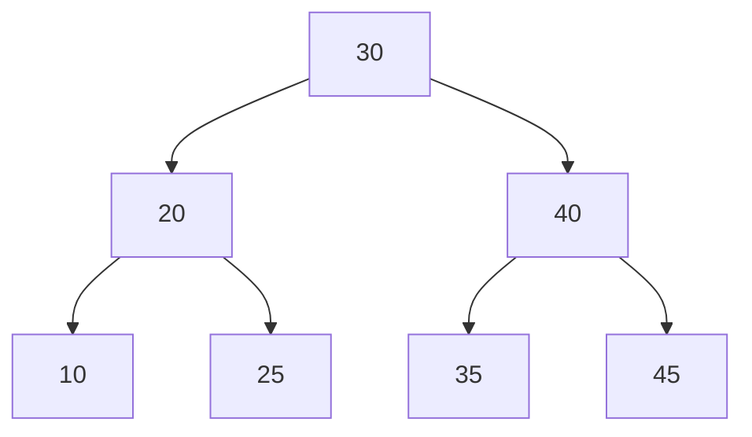
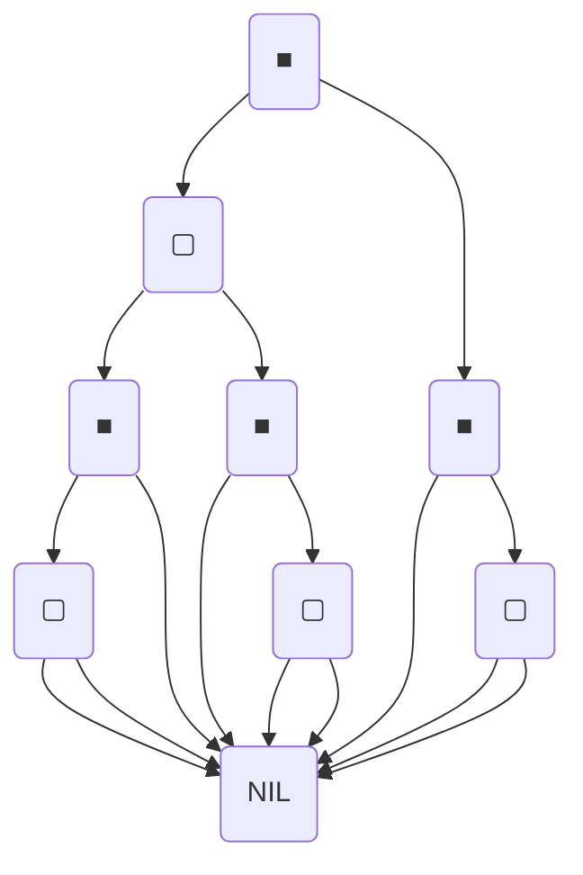

# 2. 검색트리

title: 검색트리
date: 2024-12-18 21:30:00 +09:00
categories: [Language, C++]
tags: [C++]

# 이진 검색 트리

## 이진 검색 트리의 특징

1. 각 노드의 키 값은 모두 다르다.
2. 각 노드는 최대 2개의 자식을 가진다.
3. 임의의 노드 키 값은 왼쪽에 있는 모든 노드보다 크고 오른쪽의 모든 노드보다 작다.

 



## 검색(탐색)

**시간 복잡도는 O(logn)~O(n)**

```cpp
Node * BST_SearchNode(Node * true, int target){
	if(tree==NULL) return false;
	if(tree->data==target) return tree;
	else if(tree->data>target) return BST_SearchNode(tree->leftChild, target);
	else if(tree->data<target) return BST_SearchNode(tree->rightChild, target);
}
```

## 삽입

**시간 복잡도는 O(logn)~O(n)**

```cpp
void BST_InsertNode(Node * tree, Node * node){
	if( node->x < tree->x){ //현재 재귀 다계의 트리의 루트와 크기 비교
		if(tree->leftchild=NULL){
			tree->letChild=node; return; 
			}
		else BST_InsertNode(tree->leftchild, node); //넣을 자리에 이미 있으면 더 내려가야함
	}
	
	else if(node->x > tree->x){
		if(tree->rightchild=NULL){
			tree->rightchild=node;
			return;
		}
		else
			BST_InsertNode(tree->rightchild,node);
		}
	}
}
```

## 제거

**시간 복잡도는 O(logn)~O(n)**

제거하려는 노드의 자식이 몇개인지에 따라 삭제 방법이 다르다.

1. 0개임: 그냥 제거
2. 1개임
3. 2개임 : 더 큰 트리에서 더 작은 노드를 찾음 

```cpp
void *BST_SearchMinNode(Node * tree){
	if(tree==NULL) return NULL;
	if(tree->left==NULL) return tree;
	else return BST_SearchNode(tree->left);
}

Node * BST_RemoveNode(Node * tree, Node * parent, int target){
	if(tree==NULL) return NULL;
	Node * removeNode=NULL;
	
	if(tree->data>target) removeNode=BST_RemoveNode(tree->left, tree, target);
	else if(tree->data<target) removeNode=BST_RemoveNode(tree->right, tree, target); 
	else if(tree->data==target) removeNode=tree;
	
	//1. 서브트리 0개인 노드 제거
	if(tree->left==NULL&tree->right==NULL){
		if(parent->left==tree) parent->left = NULL;
		if(parent->right==tree) parent->right = NULL;
	
	//2. 서브트리 1개인 노드 제거
	else if(tree-> left==NULL || tree->right == NULL ){
		Node * tree = NULL;
		if(tree->left!=NULL) temp=tree->left; 
		if(tree->right!=NULL) temp=tree->right;
		if(parent->left==tree) parent->left=temp;
		else parent->right=temp;
	}
	
	//3. 서브트리 2개인 노드 제거
	else if(tree->left != NULL && tree->right!=NULL){
		Node * minNode_of_BiggerNodes = BST_SearchMinNode(tree->right);
		minNode_of_BiggerNodes=BST_RemoveNode(tree, NULL, minNode_of_Bigger -> data);
		tree->data=minNode_of_BiggerNodes->data;
		}
	}
return removeNode;
}
		
```

# 레드 블랙 트리

## 특징

1. 루트는 블랙
2. 모든 리프는 블랙
3. 노드가 레드면 자식은 블랙
4. 루트~임의의 리프 경로의 블랙 수는 모두 동일하다.



NIL은 리프노드. black임

# B-트리

## 특징

- 이진트리보다 더 많은 자식을 가질 수 있다. ($\frac{k}{2}$~k개)
- 자료구조의 높이를 맞춰준다.
- 하나의 노드가 1개 이상의 데이터를 가진다.(M개)

1. 노드 자료가 N이면 자식 수는  N+1
2. 각 노드는 정렬된 상태
3. 루트는 적어도 자식이 2개 이상이어야 함
4. 중복 안됨
5. 외부 노드는 모두 같은 레벨에 있어야 함

## 초기화

```cpp
struct BTreeNode{
	friend class BTree;
	private: 
		vector<int> keys; //키 저장된 배열
		int t; //최소차수, 모든 노드는 최대 2*degree-1개의 키를 가질 수 있다.
		vector<BTreeNode *> children;
		int numofKeys; //현재 키 수
		bool leaf; //참이면 리프노드
	
	public:
		BTreeNode(int degree_in, bool _leaf);
}

BTreeNode::BTreeNode(int degree_in, bool _leaf):
	t(degree_in), numofkeys(0), leaf(true){
	keys.resize(t*2-1,0);
	children.resize(t*2,nullptr);
}
	
```

## 검색

**시간복잡도 O(logn)**

$key_{i-1}<x<key_i$인 두 키를 찾아 분기 해야 할 지식을 찾는다.

분기 후에는 이진 트리와 동일.

```cpp
BTreeNode * BTreeNode::Search(int k){
	if(numofkeys>0){
		int i=0;
		while(i<numofkeys&&keys[i]) ++i;
		if(i<numofkeys && keys[i]==k) return this;
		if(children[i]) return children[i]->serach(k);
		else return 
```

## 삽입

**시간복잡도 O(logn)**

실제로 노드가 들어가야할 리프노드는 밀면서 넣을곳을 찾고, 중간 노드는 경로만 찾음

```cpp
void BTreeNode::SplitChild(int idx, BTreeNode * leaf){
	BTreeNode * right = new BTreeNode(t, left->leaf);
	
	//키가 2t-1이면 자식 키는 t-1이고 본인 키는 1
	left->numofkeys=t-1;
	right->numofkeys=t-1;
	
	for(int i=0; i<t-1; ++i){ //키 복사
		right->keys[i] = left->keys[i++];
		left->keys[i++]=0; //값 비게
	}
	
	if(!left->leaf){
		for(int i=0; i<t; ++i){
			right->children[i]=left->children[i++]; //포인터 재분배
			}
		}
		
	for(int i=numofkeys; i>idx; --i){ //기존 자식과 키 뒤로 밀기
		keys[i]=keys[i-1];
		children[i+1]=children[i];
	}
	
	keys[idx]=left->keys[t-1]; //분리하는 자식의 가운데 키를 삽입하고 오른쪽 자식 삽입
	left->keys[t-1]=0;
	children[idx+1]=right;
	++numofkeys; //키 수 증가
	
	}
	
	
void BTreeNode::Insert(int k){
	/*(현재 노드가 리프 노드면 꽉 찬 상태일 리 없음. 
	다음 자식노드가 찼다면 splitChild 되기 때문*/
	
	if(leaf){//리프노드면
		int i=numokkeys-1 ; //넣을 자리 찾기
		while(i>=0 && keys[i]>k){
			keys[i+1]=keys[i]; --i;
			}
		keys[i+1]=k;
		++numofkeys;
		}
	
	else{ //리프노드가 아니면
		int i=numofkeys-1;
		while(i>=0&&keys[i]>k) --i;
		if(children[i+1] -> IsFull(){ //삽입할 자식이 꽉 참
			splitchild(i+1, children[i+1];
			if(keys[i+1]<k) ++i;
		}
		children[i+1]->Insert(k);
	}
}		

bool BTreeNode:IsFull() const
{
	return numofkeys==2*t-1;
}

		
```

## **제거**

**시간복잡도 O(logn)**

1. 현재 노드를 기준으로 삭제하려는 키가 관리하는 키 배열에 있다면
    1. 리프노드라면: 해당 키 위치 뒤쪽 값을 한칸씩 당겨 덮어씀
    2. 리프노드가 아니라면: 
        
        해당 keys[idx]에 치환할 수 있는 값 찾아야 함. 
        
        왼쪽 서브트리 child[idx]가 충분한 키를 가지고 있다면 왼쪽의 가장 큰 값을 가져오고 치환하고 해당 값 제거(재귀로)
        
        충분하지 않으면 오른쪽에서 가져온다.
        
        오른쪽도 없으면 두 서브트리 key 개수가 t보다 작으므로 병합하여 2t-1 만들고 삭제할 값을 다시 찾는다.
        

2. 현재 노드에 삭제할 키가 없으면 자식 노드에서 키를 찾는다.

자식 노드가 충분한 키를 가지고 있지 않다면 삽입과 반대로 키를 보충한다.

좌/우에서 키를 가져오고 충분하지 않으면 병합한다.

```cpp

void BTreeNode::IsEnough() const{
	return numofkeys>=t; 
}

//k보다 크거나 같은 키를 갖는 인덱스를 찾음
void BTreeNode::FindKey(int k) const{
	int i=0;
	while(i <numofkeys&&keys[i]<k) ++i; 
	return i;
}

void BTreeNode::Remove(int k){
	int idx=FindKey(k);
	if(idx<numOfKeys&&keys[idx]==k){ //지워야 할 인덱스가 현재 노드에 있다면
		leaf?RemoveFromLeaf(idx) : RemoveFromNonLeaf(idx);
	}
	else{
		if(leaf){ //키가 존재하지 않음
			return; 
		}
		
		bool isLast=(idx==numofkeys); //키가 마지막 자식 노드의 서브트리에 있는지 확인
		
		// 자식 노드가 충분한 키(t개)를 가지고 있지 않다면
		if(!children[idx]->IsEnough()) Fill(idx);
		
		/*마지막 자식 노드가 병합한 상태라면 그 이전 자식노드와 병합해서 만들어진것이므로 
				(idx-1) 자식노드에 재귀를 진행함.
				아니라면 (idx) 자식 노드는 최소 t키를 가지고 있으므로 재귀한다.*/
		if(isLast&&idx>numofkeys) children[idx-1]->Remove(k);
		else children[idx]->Remove(k);
	}
}

//리프 노드일때 제거
void BTreeNode:RemoveFromLeaf(int idx){ 
	//키를 앞으로 밂
	for( int i=idx+1; i<numofkeys; ++i) keys[i-1]=keys[i];
	keys[numofkeys-1]=0;
	--numofkeys;
}

//리프노드가 아닐때 제거
void BTreeNode::RemoveFromNonLeaf(int idx){
	int k=keys[idx];
	
	if(children[idx]->IsEnough()){ //children[idx]가 t 개 키 이상이라면
		int pred=GetPred(idx);
		keys[idx]=pred;
		children[idx]->Remove(pred);
	}
	
	else if(children[idx+1]->IsEnough()){ //children[idx]가 t 개 보다 적은 키를 가지면
		int succ=GetSucc(idx);
		keys[idx]=succ;
		children[idx+1]->Remove(succ);
	}
	
	//둘 다 부족하면 병합
	else{
		Merge(idx);
		children[idx]->Remove(k);
	}
}

//전임자를 가져옴
void BTreeNode::GetPred(int idx){
	BTreeNode* cur =children[idx];
	while(!cur->leaf) cur=cur->children[cur->numofkeys];
	
	return cur->keys[cur->numofkeys-1];
}

//후임자를 가져옴
void BTreeNode::GetSucc(iut idx){
	BTreeNode * cur = children[idx+1];
	while(!cur->leaf) cur=cur->children[0];
	
	return cur->keys[0];
}

//왼쪽에서 보충함
void BTreeNode::BorrowFromPrev(int idx){
	//children[idx-1]를 key[idx-1]에 저장하고 key[idx-1]를 chilren[idx]의 좌측에

	BTreeNode * child =children[idx];
	BTreeNode * sibling = children[idx-1];
	
	for(int i=child->numofkey-1; i>=0;--i) chilren->keys[i+1]=child->keys[i];
	
	if(!child->leaf){
		for(int i=child->numofkeys; i>=0; --i)
			child->children[i+1]=child->children[i];
	}
		
	child->keys[0]=keys[idx-1];
	
	//자식도 같이 움직임
	if(!child->leaf) child->children[0]=sibling->children[sibling->numofkeys];
	
	keys[idx-1]=sibling->keys[sibling->numofkeys-1];
	
	++child->numofkeys;
	--sibling->numofkeys;
		
	
}

//오른쪽에서 보충함
void BTreeNode::BorrowFromNext(int idx){
	//children[idx+1]를 key[idx+1]에 저장하고 key[idx+1]를 chilren[idx]에

	BTreeNode * child =children[idx];
	BTreeNode * sibling = children[idx+1];
	
	//keys[idx]는 children[idx]의 마지막 키로 삽입됨
	child->keys[child->numofkeys]=keys[idx];
	
	if(!child->leaf) 
		child->children[child->numofkeys+1]=sibling->children[0];
		
	keys[idx=sibling->keys[0];
	
	for(int i=1; i<sibling->numofkeys; ++i)
		sibling->keys[i-1]=sibling->keys[i];
	
	if(!sibling->leaf)
		for(int i=1;i<=sibling->numofkeys;++i)
			sibling->children[i-1]=sibling->children[i];
			
	
	
	++child->numofkeys;
	--sibling->numofkeys;
		
}

//병합
void Merge(int idx){
	//children[idx+1]은 연산 후에 제거됨
	BTreeNode* child = children[idx];
	BTreeNode* sibling = children[idx+1];
	
	//키를 왼쪽 자식에 밀어 넣음
	int childEnd=child->numofkeys;
	child->keys[childEnd]=keys[idx];
	
	//형제 자식 노드를 복사하여 넣음
	if(!child->leaf){
		for(int i=0; i<=sibling->numofkeys; ++i) 
			child->children[i+childEnd]=sibling->children[i];
	}
	
	//기존 키 하나를 뺏으므로 기존 키 배열을 조정
	for(int i=idx+1; i<numofkey; ++i)
		keys[i-1]=keys[i];
		
	//children[idx+1]을 삭제할거니까 자식 노드도 움직임
	for(int i=idx+2; i<=numofkeys; ++i) 
		children[i-1]=children[i];
		
	//자식과 현재 노드의 키 수를 업데
	child->numofkeys+=(sibling->numofkeys+1);
	--numofkeys;
	
	delete sibling;
}

void BTreeNode:Fill(int idx){
	if(idx!=0&&children[idx-1]->IsEnough()) BorrowFromPrev(idx);
	else if(idx!=numofkeys&&children[idx+1]->IsEnough()) BorrowFromNext(idx);
	else idx == numokkeys?Merge(idx-1):Merge(idx); //못빌려오면 병합하기
}
```

```cpp

void BTreeNode::IsEnough() const{
	return numofkeys>=t; 
}

//k보다 크거나 같은 키를 갖는 인덱스를 찾음
void BTreeNode::FindKey(int k) const{
	int i=0;
	while(i <numofkeys&&keys[i]<k) ++i; 
	return i;
}

void BTreeNode::Remove(int k){
	int idx=FindKey(k);
	if(idx<numOfKeys&&keys[idx]==k){ //지워야 할 인덱스가 현재 노드에 있다면
		leaf?RemoveFromLeaf(idx) : RemoveFromNonLeaf(idx);
	}
	else{
		if(leaf){ //키가 존재하지 않음
			return; 
		}
		
		bool isLast=(idx==numofkeys); //키가 마지막 자식 노드의 서브트리에 있는지 확인
		
		// 자식 노드가 충분한 키(t개)를 가지고 있지 않다면
		if(!children[idx]->IsEnough()) Fill(idx);
		
		/*마지막 자식 노드가 병합한 상태라면 그 이전 자식노드와 병합해서 만들어진것이므로 
				(idx-1) 자식노드에 재귀를 진행함.
				아니라면 (idx) 자식 노드는 최소 t키를 가지고 있으므로 재귀한다.*/
		if(isLast&&idx>numofkeys) children[idx-1]->Remove(k);
		else children[idx]->Remove(k);
	}
}

//리프 노드일때 제거
void BTreeNode:RemoveFromLeaf(int idx){ 
	//키를 앞으로 밂
	for( int i=idx+1; i<numofkeys; ++i) keys[i-1]=keys[i];
	keys[numofkeys-1]=0;
	--numofkeys;
}

//리프노드가 아닐때 제거
void BTreeNode::RemoveFromNonLeaf(int idx){
	int k=keys[idx];
	
	if(children[idx]->IsEnough()){ //children[idx]가 t 개 키 이상이라면
		int pred=GetPred(idx);
		keys[idx]=pred;
		children[idx]->Remove(pred);
	}
	
	else if(children[idx+1]->IsEnough()){ //children[idx]가 t 개 보다 적은 키를 가지면
		int succ=GetSucc(idx);
		keys[idx]=succ;
		children[idx+1]->Remove(succ);
	}
	
	//둘 다 부족하면 병합
	else{
		Merge(idx);
		children[idx]->Remove(k);
	}
}

//전임자를 가져옴
void BTreeNode::GetPred(int idx){
	BTreeNode* cur =children[idx];
	while(!cur->leaf) cur=cur->children[cur->numofkeys];
	
	return cur->keys[cur->numofkeys-1];
}

//후임자를 가져옴
void BTreeNode::GetSucc(iut idx){
	BTreeNode * cur = children[idx+1];
	while(!cur->leaf) cur=cur->children[0];
	
	return cur->keys[0];
}

//왼쪽에서 보충함
void BTreeNode::BorrowFromPrev(int idx){
	//children[idx-1]를 key[idx-1]에 저장하고 key[idx-1]를 chilren[idx]의 좌측에

	BTreeNode * child =children[idx];
	BTreeNode * sibling = children[idx-1];
	
	for(int i=child->numofkey-1; i>=0;--i) chilren->keys[i+1]=child->keys[i];
	
	if(!child->leaf){
		for(int i=child->numofkeys; i>=0; --i)
			child->children[i+1]=child->children[i];
	}
		
	child->keys[0]=keys[idx-1];
	
	//자식도 같이 움직임
	if(!child->leaf) child->children[0]=sibling->children[sibling->numofkeys];
	
	keys[idx-1]=sibling->keys[sibling->numofkeys-1];
	
	++child->numofkeys;
	--sibling->numofkeys;
		
	
}

//오른쪽에서 보충함
void BTreeNode::BorrowFromNext(int idx){
	//children[idx+1]를 key[idx+1]에 저장하고 key[idx+1]를 chilren[idx]에

	BTreeNode * child =children[idx];
	BTreeNode * sibling = children[idx+1];
	
	//keys[idx]는 children[idx]의 마지막 키로 삽입됨
	child->keys[child->numofkeys]=keys[idx];
	
	if(!child->leaf) 
		child->children[child->numofkeys+1]=sibling->children[0];
		
	keys[idx=sibling->keys[0];
	
	//형제랑 형제의 자식노드도 당기기
	for(int i=1; i<sibling->numofkeys; ++i)
		sibling->keys[i-1]=sibling->keys[i];
	
	if(!sibling->leaf)
		for(int i=1;i<=sibling->numofkeys;++i)
			sibling->children[i-1]=sibling->children[i];
			

	++child->numofkeys;
	--sibling->numofkeys;
		
}

//병합
void Merge(int idx){
	//children[idx+1]은 연산 후에 제거됨
	BTreeNode* child = children[idx];
	BTreeNode* sibling = children[idx+1];
	
	//키를 왼쪽 자식에 밀어 넣음
	int childEnd=child->numofkeys;
	child->keys[childEnd]=keys[idx];
	
	//형제 자식 노드를 복사하여 넣음
	if(!child->leaf){
		for(int i=0; i<=sibling->numofkeys; ++i) 
			child->children[i+childEnd]=sibling->children[i];
	}
	
	//기존 키 하나를 뺏으므로 기존 키 배열을 조정
	for(int i=idx+1; i<numofkey; ++i)
		keys[i-1]=keys[i];
		
	//children[idx+1]을 삭제할거니까 자식 노드도 움직임
	for(int i=idx+2; i<=numofkeys; ++i) 
		children[i-1]=children[i];
		
	//자식과 현재 노드의 키 수를 업데
	child->numofkeys+=(sibling->numofkeys+1);
	--numofkeys;
	
	delete sibling;
}

void BTreeNode:Fill(int idx){
	if(idx!=0&&children[idx-1]->IsEnough()) BorrowFromPrev(idx);
	else if(idx!=numofkeys&&children[idx+1]->IsEnough()) BorrowFromNext(idx);
	else idx == numokkeys?Merge(idx-1):Merge(idx); //못빌려오면 병합하기
}
```